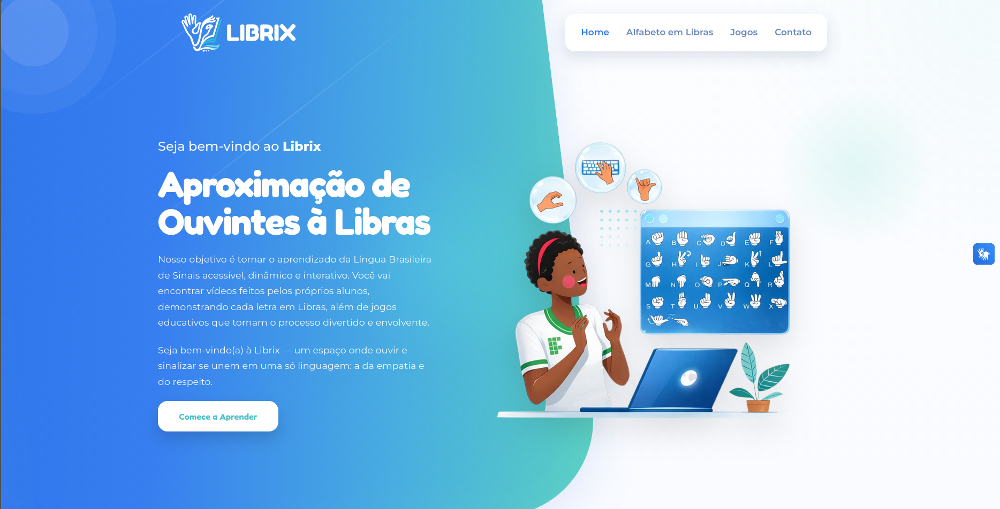

<div align="center">

# 🤟 Librix

Uma aplicação web interativa e acessível desenvolvida para aproximar ouvintes à **Língua Brasileira de Sinais (Libras)** de forma dinâmica e envolvente.

> 🔗 **[Acesse o projeto online aqui](https://librix-kappa.vercel.app/)**

</div>

---

## 💻 Preview

<div align="center">
  
</div>

## 🧠 Sobre o Projeto

O **Librix** é um projeto de cunho acadêmico e tecnológico voltado para a inclusão. Nosso objetivo é tornar o aprendizado da Língua Brasileira de Sinais acessível. A plataforma funciona como um espaço onde ouvir e sinalizar se unem em uma só linguagem: a da empatia e do respeito.

## ✨ Principais Funcionalidades

* 🔠 **Alfabeto em Libras:** Visualização clara e interativa de todas as letras do alfabeto[cite: 3].
* 🎥 **Vídeos Práticos:** Material visual gravado pelos próprios alunos demonstrando cada sinal na prática.
* 🎮 **Jogos Educativos:** Gamificação integrada para tornar o processo de aprendizado lúdico e divertido.
* 🌧️ **Animações Dinâmicas:** Implementação de efeitos visuais imersivos (como animações de chuva de libras) para enriquecer a experiência do usuário[cite: 3].
* 📱 **Design Responsivo:** Interface fluida e amigável estruturada em componentes SPA (`Home`, `Alfabeto`, `Jogos`, `Contato`)[cite: 3].

## 🛠️ Tecnologias Utilizadas

O projeto foi construído com as seguintes tecnologias e ferramentas:

* **[React](https://reactjs.org/)** (Biblioteca principal para construção da interface)[cite: 3]
* **[Vite](https://vitejs.dev/)** (Bundler ultrarrápido para o ambiente de desenvolvimento)[cite: 3]
* **[JavaScript (ES6+)](https://developer.mozilla.org/pt-BR/docs/Web/JavaScript)** (Lógica de componentes e animações)[cite: 3]
* **[CSS3](https://developer.mozilla.org/pt-BR/docs/Web/CSS)** (Estilização pura e organização modular dos estilos)[cite: 3]

## 🚀 Como rodar o projeto localmente

Siga os passos abaixo para rodar o Librix no seu ambiente de desenvolvimento:

### Pré-requisitos
* Git instalado
* [Node.js](https://nodejs.org/) instalado

### Instalação e Execução

```bash
# Clone este repositório
git clone [https://github.com/DanielSousa07/Librix.git](https://github.com/DanielSousa07/Librix.git)

# Acesse a pasta do projeto
cd Librix

# Instale as dependências
npm install

# Inicie o servidor de desenvolvimento
npm run dev
```

---

<div align="center">
  Desenvolvido com 💻 e ☕ por <a href="https://github.com/DanielSousa07">Daniel Sousa</a>
</div>
